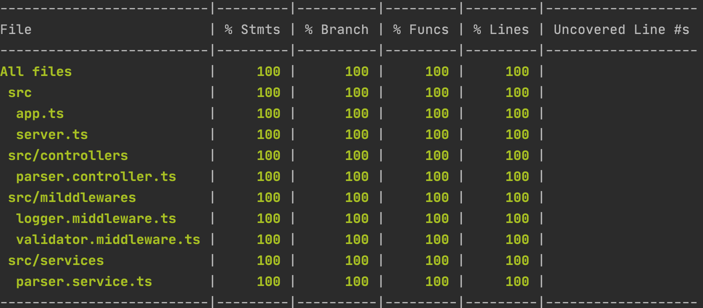

# parser-service

*A simple node js implementation to parse a input payload in pre-defined format.*

TypeScript usage is favoured as it provides types safety at build time and intelligence for IDE like VS Code, WebStorm comes really handy boost to productivity as well as production bugs will be reduced to a significant amount since most of the code vulnerabilities are identified during the build phase itself.

Separation of concern principle is applied; 

 - Controllers – Implements the rest end points
 - Services – business logics are implemented here
 - Model – holds the interfaces and data models enforce strong typing.
 - App.ts – application class defines functions to initializes middlewares and controllers
 - Server.ts – bootstraps the application.

Each folder plays a specific role. this makes the project easy to be unit tested.

The files or components that are related to a particular feature have been grouped, this enhances the ability to share code across projects.

The tests have been written to test the functions and routes, Integration tests has also been done to cover the end to end flow.

#### Libraries used
* **chai, chai-http** – assertion utilities used for integration and unit test cases
* **mocha** – test runner
* **nodemon** – watch for changes and live reload
* **nyc** – code coverage 
* **rimraf** – cross env rmrf like utility to clean up build folder
* **ts-node** – run ts code directly for development purposes
* **express-validator** – to validate the request payload
* **typescript, express**.


#### Installation

parser-service requires *node v10+* to run

```sh
npm install
```

#### Build
```sh
npm run build
```
#### run in dev mode
```sh
npm run start:dev
```
this will run the application in watch mode with live reload 

### run
```shell script
npm start
```
The app will be running in http://localhost:5000

#### Endpoints

```shell script
 /api/v1/parse (POST)
 /api/v2/parse (POST)
```

#### Testing

To run unit test cases
```sh
npm run test
```
To run integration tests
```sh
npm run test:integ
```
#### Manual Testing :)

Any http utility such as postman can be used to test the api endpoints, below are the curl commands to test from a shell

```shell script
curl --location --request POST 'localhost:5000/api/v1/parse' \
--header 'Content-Type: application/json' \
--data-raw '{
    "data":"JHON0000MICHAEL0009999567"
}'
```

```shell script
curl --location --request POST 'localhost:5000/api/v2/parse' \
--header 'Content-Type: application/json' \
--data-raw '{
    "data":"JHON0000MICHAEL0009999567"
}'
```

#### Code coverage
```sh
npm run coverage
```

the below image show the current code coverage


